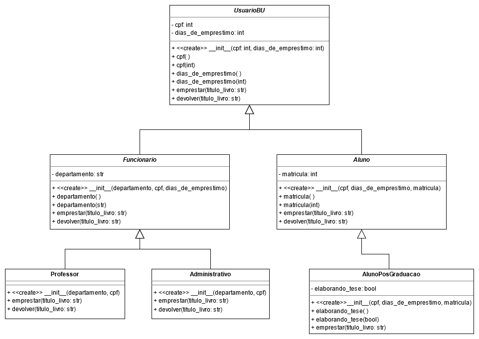

# Exercício 05 - Herança e Classes Abstratas

Escreva um programa em Python que possua cinco classes: UsuarioBU, Funcionario, Professor, Administrativo, Aluno e AlunoPosGraduacao.

Defina uma hierarquia de herança entre essas classes.

A implementação deve atender às seguintes regras:

1. Não existem instâncias de UsuarioBU, Funcionario e Aluno, somente dos seus sub-tipos
2. Ao emprestar um livro:
    1. Todos os alunos de pós-graduação retornam a mensagem: "Aluno de matricula "matricula" pegou emprestado o livro: "titulo_do_livro" com "dias_de_emprestimo" dias de prazo"
    2. Todos os professores retornam a mensagem: "Professor do departamento "departamento" pegou emprestado o livro: "titulo_do_livro" com "dias_de_emprestimo" dias de prazo"
    3. Todos os funcionarios administrativos retornam a mensagem: "Funcionario administrativo do departamento "departamento" pegou emprestado o livro: "titulo_do_livro" com "dias_de_emprestimo" dias de prazo"
3. Ao devolver um livro:
    1. Os alunos retornam a mensagem: "Aluno de matricula "matricula" devolveu o livro: "+titulo_do_livro
    2. Os professores retornam a mensagem: "Professor do departamento "departamento" devolveu o livro: "+titulo_do_livro
    3. Os funcionarios administrativos retornam a mensagem: "Funcionario administrativo do departamento "departamento" devolveu o livro: "+titulo_do_livro
4. Somente os funcionários possuem departamento
5. Somente os alunos possuem matricula
6. O número de dias de empréstimo para professor é 20 dias
7. O número de dias de empréstimo para funcionario administrativo é 10 dias
8. Alunos de pós-graduação possuem o número de dias de empréstimo parametrizáveis no construtor. E se o aluno estiver elaborando a tese (elaborando_tese = True), então o número de dias de empréstimo é dobrado

Observação:

Ordem de parâmetros dos construtores:

- Aluno(cpf: int, dias_de_emprestimo: int, matricula: int)

- Funcionario(departamento: str, cpf: int, dias_de_emprestimo: int)

- AlunoPosGraduacao(cpf: int, dias_de_emprestimo: int, matricula: int)

Siga o exemplo anexo e complete com o seu código.

Utilize exatamente os mesmos nomes de classe e das operações que estão definidos no diagrama.

